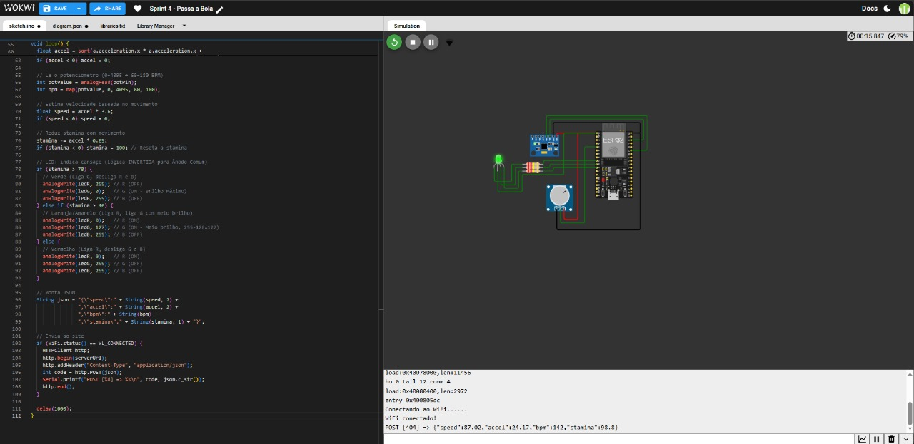
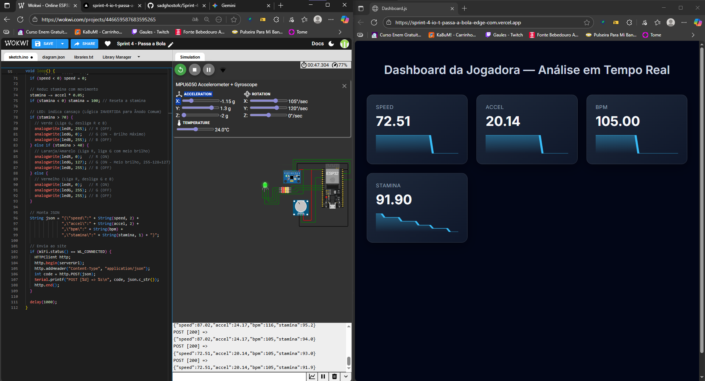

# ⚽ Sensor de Desempenho para Jogadoras – ESP32 + Dashboard Web

Este projeto simula um **sensor de desempenho para jogadoras**, usando o **ESP32** no [Wokwi](https://wokwi.com/projects/446659587683595265) e um **dashboard em tempo real** hospedado na **Vercel**.

O sistema coleta dados de:
- 🧭 **MPU6050** – movimento e aceleração da jogadora  
- 🎚️ **Potenciômetro** – nível de esforço ou batimentos simulados  
- 💡 **LED RGB** – indica o estado físico da jogadora (fadiga, energia, equilíbrio)

Os dados são enviados via **HTTP** para um servidor web, onde o dashboard exibe as informações em tempo real.

## 🚀 Funcionalidades

✅ Leitura de sensores em tempo real (MPU6050 + potenciômetro)  
✅ Controle visual com LED RGB (representa o estado físico da jogadora)  
✅ Envio automático dos dados via Wi-Fi para o dashboard web  
✅ Simulação completa no **Wokwi**  

## 🧩 Componentes usados no Wokwi

-  MPU6050 | Acelerômetro/Giroscópio
- Potenciômetro | Simulando os batimentos
- LED RGB (com resistores 220Ω) | Indicador visual

## ▶️ Como executar

🔗 Abra a Simulação no [Wokwi](https://wokwi.com/projects/446659587683595265)

1.Clique em Start Simulation.

2.Abra o [Dashboard](https://sprint-4-io-t-passa-a-bola-edge-com.vercel.app/) no navegador

3.Veja os dados em tempo real:
- Velocidade
- aceleração
- BPM
- Stamina

## 👨‍💻 Integrantes

- Daniel Laureano da Luz - RM565899
- Gabriel Del Sole Speck - RM562513
- Marcos Antonio da Silva - RM566451
- Paulo Gustavo Pessoa da Silva - RM566194
- Rone Cruz Santos - RM566558

## 📷 Imagens do projeto

